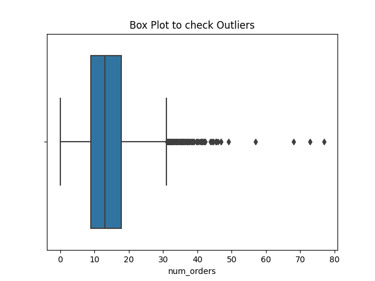
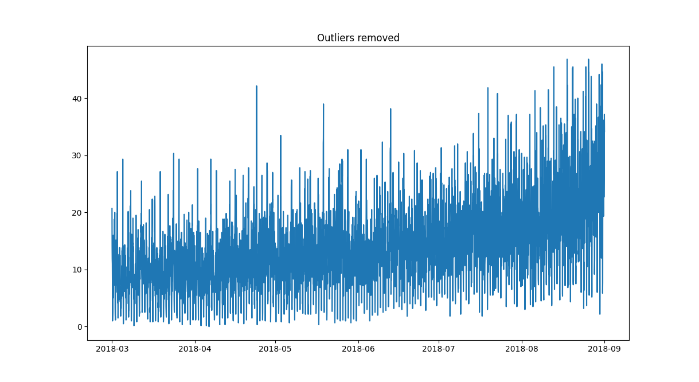
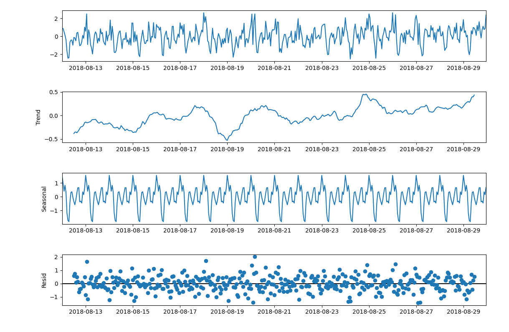
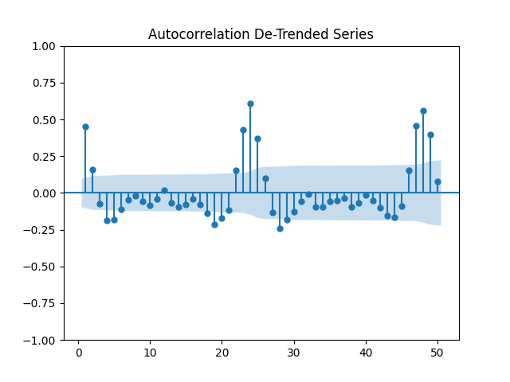
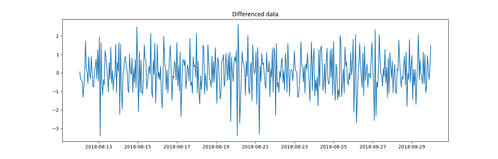
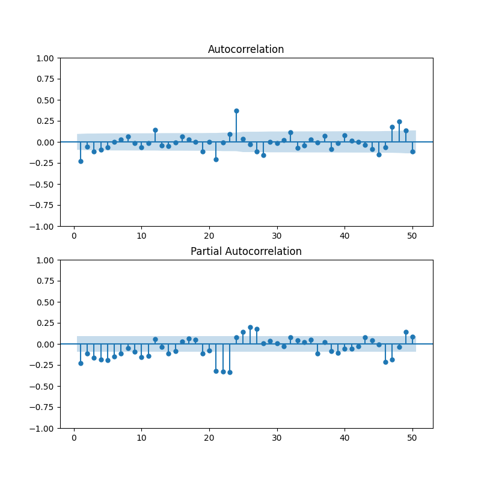
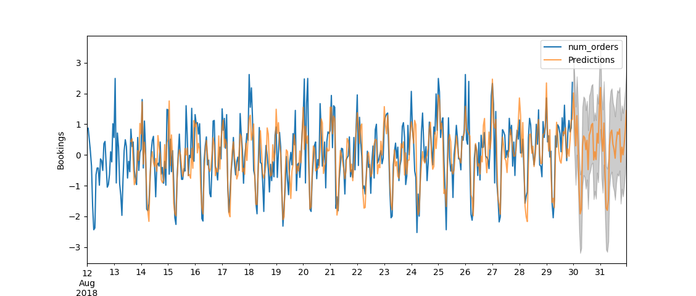
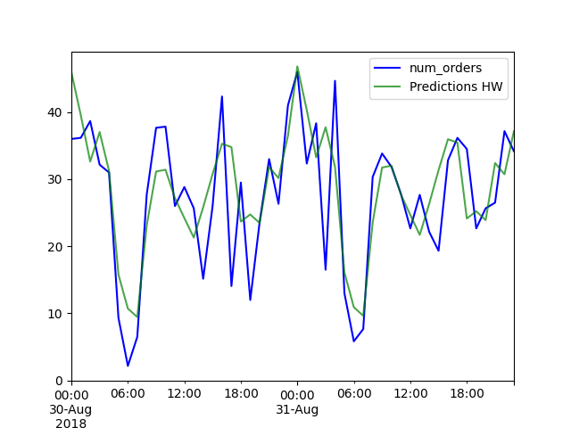

# **`Forecasting of Hourly Bookings`**

_Analysis and Interpretations_

# Original Data
a)Data points are seperated by an interval of 10 mins.
b) The data points are aggregated inorder to convert them into hourly bookings.

# Visualize and Remove Outliers

a) The data is plotted to visualize outliers.
b) IQR is used to remove the outliers based on the first and second quartiles.

# Time Series Decomposition

a) Extraction of Seasonal patterns, Trend and Residuals.

# De-Trended Series

a)Data was transformed using a rolling average of 24 data-points.
b) Observed seasonal patterns at periods 24 and 48 in the ACF plot.

# 1. Transformation with Differencing
# 2. ACF and PACF plot

a) Taken the first difference as data transformation to bring stationarity to the data.
b) The ACF and PACF plots were used to determine the model order.
c) The first differencing as well as ACF and PACF plots helps us determine the non-seasonal patterns.

# 1. Transformation with Seasonal Differencing
# 2. ACF and PACF plot of Seasonally differenced data

a) Taken the seasonal difference to the differenced data with a seasonal period of 24.
b) Visualizing ACF and PACF plots helps us determine the seasonal patterns of seasonally differenced data.

# SARIMA Modelling

a) Can capture both non-seasonal and seasonal patterns.
b) It is difficult to determine model order through ACF and PACF when both P and Q values are non zero.
c) AIC values - Good at choosing predictive models.
    -- Lower AIC score -> Better Model
    -- Helps to overcome overfitting.
d) Box-Cox transformation was applied to stabilize the variance.
e) The mean RMSE obtained was 0.5.

# SARIMA Model diagnostics

a) Model Order – Non Seasonal (1,0,1); Seasonal (5,1,1,24).
b) Mean Residual – 0.05.
c) Residual looks like White Noise.
d) Prob(JB) - 0.16 -> Residual is close to Normal Distribution.
e) Q – Q plot is close to linear.
f) ACF in Correlogram shows no correlations at lag > 0. 
g) Prob(Q) - 0.79 -> Residuals are uncorrelated.

# Exponential Smoothing

a) Model chosen as a result of Trend and Seasonal Characteristics.
b) Trend & Seasonal are - Additive.
c) Mean RMSE - 0.7
d) Seasonal ARIMA model performs better based on RMSE.

# Next Steps

a) Deep Learning approach – LSTMs. Can use CNN for feature extractor.
b) Data such as Booking Price and Holidays for Demand Forecasting.  Can use weather information as an influencial factor.
   -- Advanced models such as Vector Auto-Regression and Dynamic Harmonic Regression could be used.

